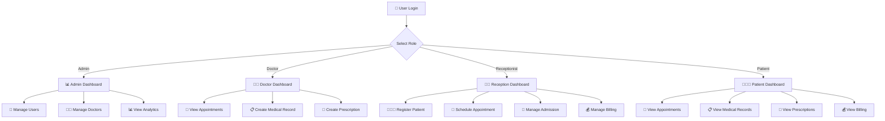

# 🏥 Hospital Management System (HMS)

<p align="center">
  
  
  
  
  
</p>

<p align="center">
  <strong>A modern full-stack Hospital Management System built with Laravel REST API and React.</strong>
</p>

<p align="center">
  <a href="#-features">
    
  </a>
</p>

<p align="center">
  <a href="#-demo-video">🎥 Demo</a> •
  <a href="#-features">✨ Features</a> •
  <a href="#-system-architecture">🏗️ Architecture</a> •
  <a href="#-screenshots">📸 Screenshots</a> •
  <a href="#-installation">⚙️ Installation</a> •
  <a href="#-security">🔐 Security</a>
</p>

---

# 🌟 Project Overview

**Hospital Management System (HMS)** is a full-stack healthcare management platform designed to simplify and digitize day-to-day hospital operations.

The system provides dedicated workflows for **administrators, doctors, receptionists, and patients**, allowing each role to access functionality relevant to their responsibilities.

The application follows a modern decoupled architecture:

* 🔙 **Laravel 12** provides the RESTful backend API
* ⚛️ **React + Vite** provides the frontend SPA
* 🗄️ **MySQL** stores application data
* 🔐 **Laravel Sanctum** handles API authentication
* 👥 **Role-based access control** protects role-specific functionality

The platform manages the complete hospital workflow, from **patient registration and appointment scheduling** to **admissions, medical records, prescriptions, billing, and payment tracking**.

---

# 🎥 Demo Video

<p align="center">
  <a href="https://www.youtube.com/watch?v=Kp4F01zAGjs">
    
  </a>
</p>

<p align="center">
  <strong>▶️ Click the preview above to watch the full project demonstration.</strong>
</p>

### 🎬 Demo Includes

* 🔐 User login and authentication
* 👨‍💼 Admin dashboard
* 👨‍⚕️ Doctor management
* 🧑‍🤝‍🧑 Patient management
* 📅 Appointment scheduling
* 🏥 Patient admission
* 🚪 Discharge management
* 📋 Medical records
* 💊 Prescription management
* 💰 Billing and payment tracking
* 📊 Role-based dashboard statistics


---

# 🎞️ Animated Project Preview

For a quick visual demonstration, you can add an animated GIF showing the main application workflow.

<p align="center">
  
</p>

### Recommended Preview Flow

```text
🔐 Login
   ↓
📊 Dashboard
   ↓
🧑‍🤝‍🧑 Patient Management
   ↓
👨‍⚕️ Doctor Management
   ↓
📅 Appointment Scheduling
   ↓
🏥 Admission
   ↓
📋 Medical Records
   ↓
💊 Prescription
   ↓
💰 Billing
```

Store the GIF at:

```text
docs/demo/hospital-management-demo.gif
```

---

# ✨ Features

## 🔐 Authentication & Role-Based Access

The system provides secure authentication using **Laravel Sanctum**.

Supported user roles include:

| Role               | Main Responsibilities                         |
| ------------------ | --------------------------------------------- |
| 👨‍💼 Admin        | Complete system management                    |
| 👨‍⚕️ Doctor       | Appointments, medical records, prescriptions  |
| 🧑‍💼 Receptionist | Patients, appointments, admissions            |
| 🧑‍🤝‍🧑 Patient   | Personal appointments and medical information |

Each role receives a customized experience based on its permissions.

---

## 📊 Role-Based Dashboard

The dashboard provides relevant statistics and insights based on the authenticated user's role.

### Admin Dashboard

Administrators can monitor:

* Total patients
* Total doctors
* Total appointments
* Active admissions
* Completed appointments
* Billing statistics

### Doctor Dashboard

Doctors can view:

* Upcoming appointments
* Assigned patients
* Medical records
* Prescription history
* Patient treatment information

### Receptionist Dashboard

Receptionists can manage:

* Patient registrations
* Appointment scheduling
* Admissions
* Discharges
* Billing information

### Patient Dashboard

Patients can access:

* Personal information
* Upcoming appointments
* Appointment history
* Medical records
* Prescriptions
* Billing information

---

# 🧑‍🤝‍🧑 Patient Management

The patient management module allows authorized users to manage patient information.

### Capabilities

* Register new patients
* View patient profiles
* Update patient information
* Search patient records
* View appointment history
* View admission history
* Access medical records

---

# 👨‍⚕️ Doctor Management

Administrators can manage doctors and their professional information.

### Capabilities

* Add doctors
* Update doctor information
* View doctor profiles
* Manage doctor availability
* View assigned appointments
* Track patient consultations

---

# 📅 Appointment Management

The appointment system helps manage doctor-patient scheduling.

### Appointment Workflow

```text
Patient / Receptionist
        │
        ▼
Select Doctor
        │
        ▼
Select Available Date
        │
        ▼
Select Appointment Time
        │
        ▼
Validate Schedule
        │
        ▼
Create Appointment
        │
        ▼
Doctor Consultation
        │
        ▼
Update Appointment Status
```

The system validates appointment scheduling to help prevent invalid or conflicting bookings.

---

# 🏥 Admission & Discharge Management

The system supports the complete inpatient workflow.

### Admission

Hospital staff can record:

* Patient information
* Admission date
* Assigned doctor
* Room or ward information
* Admission status
* Reason for admission

### Discharge

The discharge process can track:

* Discharge date
* Discharge status
* Treatment summary
* Doctor information
* Final billing information

---

# 📋 Medical Records

Doctors can maintain digital medical records for patients.

Medical records can include:

* Diagnosis
* Symptoms
* Clinical observations
* Treatment details
* Consultation notes
* Medical history

This provides a centralized view of patient healthcare information.

---

# 💊 Prescription Management

Doctors can create and manage prescriptions for patients.

Prescription information may include:

* Medicine name
* Dosage
* Frequency
* Duration
* Instructions
* Prescription date

Patients can view their prescription information through their dashboard.

---

# 💰 Billing & Payment Tracking

The billing module helps hospital staff manage patient financial records.

### Billing Features

* Generate patient bills
* Track billing records
* Record payment status
* Monitor pending payments
* Track completed payments
* View billing history

### Payment Workflow

```text
Patient Service
      │
      ▼
Generate Bill
      │
      ▼
Calculate Amount
      │
      ▼
Record Payment
      │
      ▼
Update Payment Status
      │
      ▼
Billing History
```

---

# 🏗️ System Architecture

The project uses a decoupled frontend and backend architecture.

```text
                 ┌─────────────────────────┐
                 │        User             │
                 │ Admin / Doctor /        │
                 │ Receptionist / Patient  │
                 └────────────┬────────────┘
                              │
                              ▼
                 ┌─────────────────────────┐
                 │     React + Vite SPA    │
                 │       Frontend UI       │
                 └────────────┬────────────┘
                              │
                         HTTP / JSON
                              │
                              ▼
                 ┌─────────────────────────┐
                 │     Laravel 12 API      │
                 │ Controllers / Services  │
                 │ Validation / Middleware │
                 └────────────┬────────────┘
                              │
                    Laravel Sanctum
                    Authentication
                              │
                              ▼
                 ┌─────────────────────────┐
                 │      MySQL Database     │
                 │ Users / Patients /      │
                 │ Doctors / Appointments  │
                 │ Records / Billing       │
                 └─────────────────────────┘
```

---

# 🔄 Complete Hospital Workflow



---

# 📂 Project Structure

```text
hospital-management-system/
│
├── backend/
│   ├── app/
│   │   ├── Http/
│   │   │   ├── Controllers/
│   │   │   ├── Middleware/
│   │   │   └── Requests/
│   │   │
│   │   ├── Models/
│   │   └── ...
│   │
│   ├── database/
│   │   ├── migrations/
│   │   ├── seeders/
│   │   └── factories/
│   │
│   ├── routes/
│   │   └── api.php
│   │
│   ├── config/
│   ├── resources/
│   ├── storage/
│   ├── .env.example
│   ├── artisan
│   └── composer.json
│
├── frontend/
│   ├── src/
│   │   ├── components/
│   │   ├── pages/
│   │   ├── layouts/
│   │   ├── services/
│   │   ├── hooks/
│   │   └── ...
│   │
│   ├── public/
│   ├── .env.example
│   ├── package.json
│   └── vite.config.js
│
├── docs/
│   ├── screenshots/
│   └── demo/
│       └── hospital-management-demo.gif
│
└── README.md
```

---

# 🛠️ Tech Stack

| Technology         | Purpose                           |
| ------------------ | --------------------------------- |
| 🐘 PHP 8.2+        | Backend runtime                   |
| 🚀 Laravel 12      | REST API framework                |
| 🔐 Laravel Sanctum | API authentication                |
| ⚛️ React           | Frontend SPA                      |
| ⚡ Vite             | Frontend development & build tool |
| 🗄️ MySQL 8.0+     | Relational database               |
| 📦 Composer        | PHP dependency management         |
| 📦 npm             | JavaScript dependency management  |
| 🔄 REST API        | Frontend-backend communication    |

---

# 📋 Requirements

## Backend

* PHP 8.2 or higher
* Composer
* MySQL 8.0 or higher
* Laravel 12 compatible PHP extensions

## Frontend

* Node.js 20.19+ or 22.12+
* npm

---

# ⚙️ Installation

## 1️⃣ Clone the Repository

```bash
git clone https://github.com/YOUR_USERNAME/hospital-management-system.git
```

Navigate to the project:

```bash
cd hospital-management-system
```

---

# 🔙 Backend Setup

Navigate to the backend directory:

```bash
cd backend
```

Install Composer dependencies:

```bash
composer install
```

Create the environment file:

```bash
cp .env.example .env
```

Generate the Laravel application key:

```bash
php artisan key:generate
```

---

## 🗄️ Configure Database

Open the backend `.env` file:

```env
DB_CONNECTION=mysql
DB_HOST=127.0.0.1
DB_PORT=3306
DB_DATABASE=hospital_management
DB_USERNAME=root
DB_PASSWORD=
```

Create the MySQL database:

```sql
CREATE DATABASE hospital_management;
```

Run migrations and seed the database:

```bash
php artisan migrate --seed
```

Start the Laravel development server:

```bash
php artisan serve
```

The backend API will run at:

```text
http://localhost:8000
```

---

# ⚛️ Frontend Setup

Open a new terminal and navigate to the frontend:

```bash
cd frontend
```

Install npm dependencies:

```bash
npm install
```

Create `frontend/.env` if you want Vite to call the Laragon API host directly. The Vite proxy is used when `VITE_API_URL` is empty:

```env
VITE_API_URL=https://carepoint.test/api
```

Copy `frontend/.env.example` to `frontend/.env` and set the API URL for your local setup.

## Appointment payments

Appointments use pay-at-hospital billing. Booking confirms the appointment without collecting online payment; staff can record payment later from the Billing screen.

## Demo accounts

These accounts are created only by the local/test database seeder. The admin password is `carepoint123`; the other demo account passwords are `password`. Never use these accounts or seeded data in production.

| Role         | Email               |
|--------------|---------------------|
| Admin        | admin@carepoint.com |
| Doctor       | chukwuma.okafor@carepoint.com |
| Receptionist | receptionist@carepoint.com   |
| Patient      | emeka.okafor@gmail.com        |

New patients can also self-register from the login page.

## Role capabilities

- **Admin** — everything: users, doctors, patients, appointments, admissions, records, prescriptions, billing.
- **Receptionist** — patients, appointment scheduling, admissions/discharge, billing & payments.
- **Doctor** — own appointments (confirm/complete), patients, medical records, prescriptions, weekly availability.
- **Patient** — book/cancel own appointments, view own records, prescriptions, and bills.

## Key API endpoints

```
POST /api/auth/register | /api/auth/login | /api/auth/logout
GET  /api/auth/me
GET  /api/dashboard/stats                     (role-specific)
CRUD /api/patients /api/doctors /api/appointments /api/admissions
CRUD /api/medical-records /api/prescriptions /api/bills /api/users
PUT  /api/doctors/{id}/availability
POST /api/admissions/{id}/discharge
POST /api/bills/{id}/pay | /api/bills/{id}/cancel
```

Configure the API URL:

```env
VITE_API_URL=http://carepoint.test/api
```

Start the React development server:

```bash
npm run dev
```

The frontend will run at:

```text
http://localhost:5173
```

---

# 🔗 Application URLs

| Application       | URL                     |
| ----------------- | ----------------------- |
| ⚛️ React Frontend | `http://localhost:5173` |
| 🚀 Laravel API    | `http://carepoint.test/api` |

---

# Production Deployment

Deploy the Laravel API and the built React app over HTTPS. The frontend can be on a separate host; set `VITE_API_URL` to the public API URL at build time and set `CORS_ALLOWED_ORIGINS` on the API to the exact frontend origin(s). For same-origin deployments, leave `VITE_API_URL` empty so the app uses `/api`, and configure the web server to serve the frontend build, send unknown frontend routes to `index.html`, and route `/api` to Laravel. Set `FRONTEND_URL` to the public frontend base URL so the Laravel root redirects to its login screen.

## Release Checklist

1. Configure the production environment from `backend/.env.example`. Set `APP_ENV=production`, `APP_DEBUG=false`, a unique `APP_KEY` (generate it with `php artisan key:generate`), HTTPS `APP_URL` and `FRONTEND_URL`, database credentials, `SANCTUM_EXPIRATION`, and allowed frontend origins. Keep `.env` and all secrets outside version control.
2. Install backend dependencies with `composer install --no-dev --optimize-autoloader` from `backend/`.
3. Build the frontend with `npm ci` and `npm run build` from `frontend/`. The default production API URL is same-origin (`/api`); provide `VITE_API_URL` at build time when frontend and API are on separate origins. The ignored local `frontend/.env` is for Vite development and is not used to override the production-mode default.
4. Point the web server document root at Laravel's `backend/public` for the API. For a separate frontend host, publish `frontend/dist` and enable SPA fallback rewrites. Use HTTPS and ensure `backend/storage` and `backend/bootstrap/cache` are writable by the PHP process.
5. Back up the production database, then run `php artisan migrate --force` from `backend/`. Do not run `db:seed` or `migrate --seed` in production; the demo seeder intentionally refuses non-local/non-test environments.
6. Run `php artisan optimize:clear` before deploying changed routes or configuration, then `php artisan optimize` after deployment. Monitor Laravel logs, configure database backups, and rehearse restore procedures.

The API exposes Laravel's `/up` health endpoint. Verify it, the login endpoint's rate limit, frontend deep-link refreshes, and the production CORS preflight from the actual hosting environment before opening access to users.

---

# 🔐 Security

The application uses Laravel's authentication and authorization features to protect sensitive hospital data.

### Security Features

* 🔐 Laravel Sanctum authentication
* 👥 Role-based access control
* 🛡️ Protected API routes
* 🔑 Secure authentication tokens
* ✅ Server-side request validation
* 🗄️ Eloquent ORM for database operations
* 🚫 Unauthorized route protection
* 🔒 Environment-based configuration
* 🧹 Input validation and sanitization
* 🔑 Password hashing using Laravel's authentication system

> Production deployments should use HTTPS, secure environment variables, proper database access controls, and appropriate backup policies.

---

# 📸 Screenshots

## 🔐 Login Page

<p align="center">
  
</p>

---

## 📊 Admin Dashboard

<p align="center">
  
</p>

---

## 👨‍⚕️ Doctor Management

<p align="center">
  
</p>

---

## 🧑‍🤝‍🧑 Patient Management

<p align="center">
  
</p>

---

## 📅 Appointment Management

<p align="center">
  
</p>

---

## 🏥 Admission Management

<p align="center">
  
</p>

---

## 💰 Billing Management

<p align="center">
  
</p>


---

# 🧪 Development Notes

### Backend API

The backend is built as a RESTful API using Laravel 12.

The frontend communicates with the backend through HTTP requests and JSON responses.

### Frontend API Configuration

The API endpoint is configured using:

```env
VITE_API_URL=http://carepoint.test/api
```

For production, replace the development URL with your deployed Laravel API URL.

---

# 🚀 Future Enhancements

* [ ] Email notifications
* [ ] SMS appointment reminders
* [ ] Doctor availability calendar
* [ ] Pharmacy management
* [ ] Laboratory management
* [ ] Blood bank management
* [ ] Hospital room management
* [ ] Medical report PDF generation
* [ ] Patient invoice PDF generation
* [ ] Advanced analytics and reports
* [ ] Real-time notifications
* [ ] WebSocket integration
* [ ] Docker deployment
* [ ] Cloud deployment
* [ ] Automated database backups
* [ ] Multi-hospital support

---

# 💡 Use Cases

The system can be adapted for:

* 🏥 Hospitals
* 🏨 Clinics
* 🩺 Medical Centers
* 👨‍⚕️ Doctor Practices
* 🧑‍⚕️ Healthcare Organizations
* 🏢 Corporate Healthcare Facilities

---

# 📈 Project Highlights

```text
🚀 Laravel 12 REST API
⚛️ React + Vite SPA
🔐 Laravel Sanctum Authentication
👥 Role-Based Access Control
🧑‍🤝‍🧑 Patient Management
👨‍⚕️ Doctor Management
📅 Appointment Scheduling
🏥 Admission & Discharge
📋 Medical Records
💊 Prescription Management
💰 Billing & Payment Tracking
📊 Role-Based Dashboard Analytics
🗄️ MySQL Database
📱 Responsive Frontend
```

---

# 🤝 Contributing

Contributions are welcome!

### 1. Fork the Repository

### 2. Create a Feature Branch

```bash
git checkout -b feature/your-feature
```

### 3. Commit Your Changes

```bash
git commit -m "Add new feature"
```

### 4. Push Your Branch

```bash
git push origin feature/your-feature
```

### 5. Open a Pull Request

---

# 📄 License

This project is available under the **MIT License**.

---

# 👨‍💻 Developer

<p align="center">
  Built with ❤️ using Laravel, React, MySQL, and modern web technologies.
</p>

<p align="center">
  ⭐ If you find this project useful, consider giving it a star!
</p>

---

<p align="center">
  
</p>
